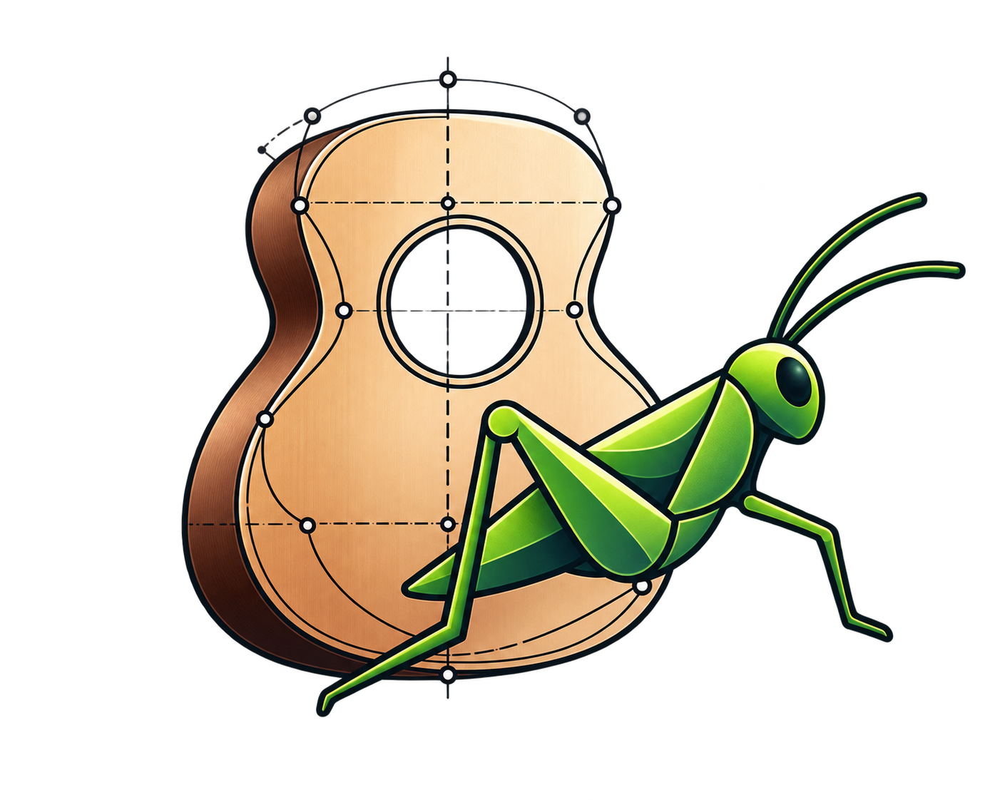

# GuitarForm



A guitar designer built as Grasshopper components for **Rhino 8**. Each component draws one part of the guitar, such as the body plate, soundhole, neck, fretboard or strings. Each one works on its own with plain inputs (numbers, points, curves), so a value several parts share, such as the heel width, comes from one slider wired to each of them.

## Requirements

- Rhino 8 (Windows), running on its default .NET runtime. The plug-in won't load if Rhino has been switched to .NET Framework with `SetDotNetRuntime`.
- .NET SDK 8 or later, to build.

## Build

From the repository folder:

```
dotnet build GuitarForm/GuitarForm.csproj
```

The plug-in is written to:

```
GuitarForm/bin/Debug/net7.0-windows/GuitarForm.gha
```

## Load in Grasshopper

**Option A: point Grasshopper at the build folder (best while developing)**

1. In Rhino, run the command `GrasshopperDeveloperSettings`.
2. Add the full path of `GuitarForm\bin\Debug\net7.0-windows`.
3. Make sure **Memory load *.GHA assemblies using COFF byte arrays** is unchecked.
4. Restart Rhino and open Grasshopper.

After this, each rebuild is picked up the next time you start Rhino.

**Option B: copy the plug-in**

1. Copy `GuitarForm.gha` into `%APPDATA%\Grasshopper\Libraries`.
2. If Windows marks the file as blocked, right-click it, open **Properties** and tick **Unblock**.
3. Restart Rhino and open Grasshopper.

Grasshopper locks the `.gha` while Rhino is running, so close Rhino before you rebuild.

## Debugging

Open `GuitarForm.sln` in Visual Studio and press **F5**. The **Rhino 8** launch profile (`GuitarForm/Properties/launchSettings.json`) builds the plug-in, then starts Rhino 8 with Grasshopper open and the debugger attached. It loads the plug-in from the build folder, so set up **Option A** above first. If Rhino is installed somewhere other than `C:\Program Files\Rhino 8`, change `executablePath` in the launch profile.

## Using the components

The components are on the **GuitarForm** tab of the Grasshopper toolbar.

The guitar is drawn **vertically**: it starts at the origin and the body length runs up the **+Y** axis. All lengths are in the Rhino document's units.

Construction geometry (such as Plate's construction lines and outline radii) is previewed **light grey**, so the outline stands out. It bakes light grey with the Continuous (solid) linetype. The **final outline** (such as Plate's Outline Lines and Outline Arcs, or a soundhole) uses the default Grasshopper preview colour, and bakes with the default attributes so it takes its layer's colour.

Each component's inputs, outputs, geometry and a quick test are described in `docs/`:

| Component | Toolbar group | What it draws | Details |
|---|---|---|---|
| Plate | Body | The body outline, from its bouts, waist, tail and heel dimensions. | [docs/Plate.md](docs/Plate.md) |
| Soundhole | Soundhole | A round soundhole. | [docs/Soundhole.md](docs/Soundhole.md#soundhole) |
| Custom Soundhole | Soundhole | A soundhole of any closed shape, placed by its area centroid. | [docs/Soundhole.md](docs/Soundhole.md#custom-soundhole) |

## Tests

The geometry is tested with NUnit and [Rhino.Testing](https://github.com/mcneel/Rhino.Testing), which loads the installed Rhino 8 into the test run, so Rhino 8 must be installed. From the repository folder:

```
dotnet test GuitarForm.Tests
```

The tests check the geometry classes (such as `PlateGeometry`) against the Quick Test values in `docs/` and the error cases, and check that the Plate outline forms one closed loop. If Rhino is installed somewhere other than `C:\Program Files\Rhino 8`, change `RhinoSystemDirectory` in `GuitarForm.Tests/Rhino.Testing.Configs.xml`.

## Troubleshooting

- **Component doesn't appear:** check that the `.gha` is in the folder you added (or in `Libraries`) and that you restarted Rhino. In Grasshopper, open **File › Special Folders › Components Folder** to confirm the location.
- **Build fails because the file is in use:** close Rhino, then rebuild.
- **No preview:** make sure the component isn't hidden or disabled, that its required inputs are connected, and that it shows no error.
